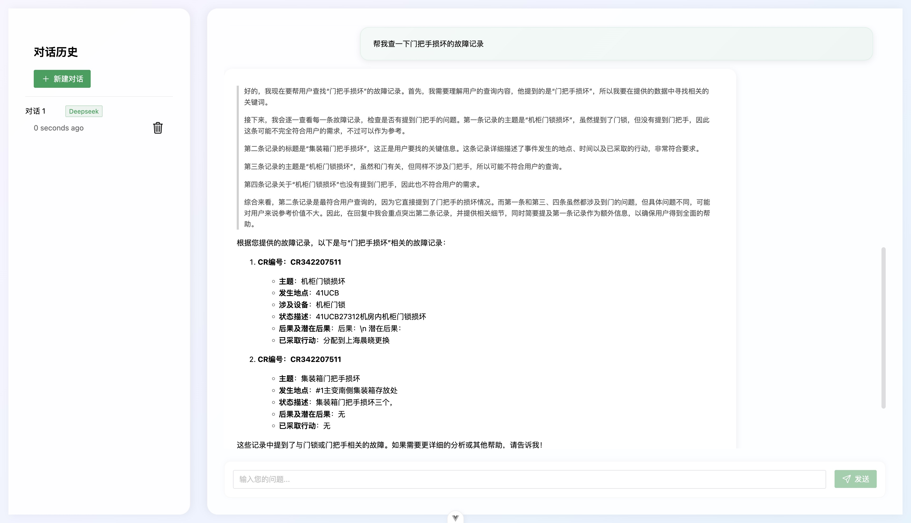
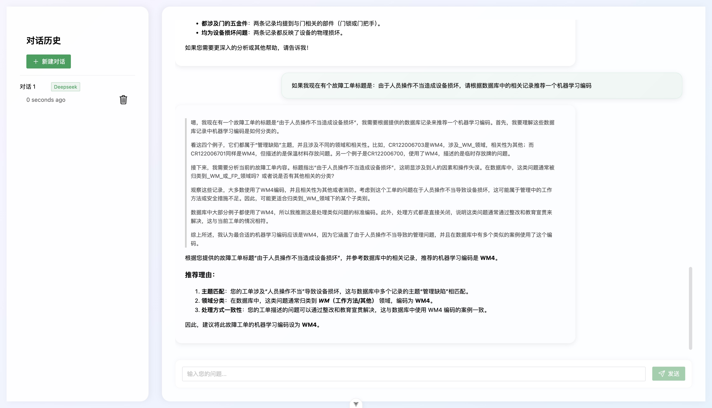
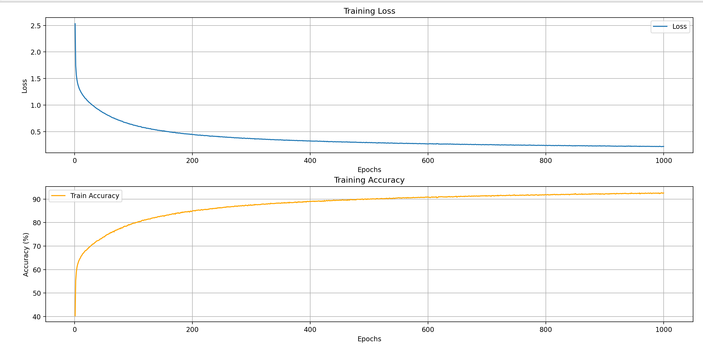
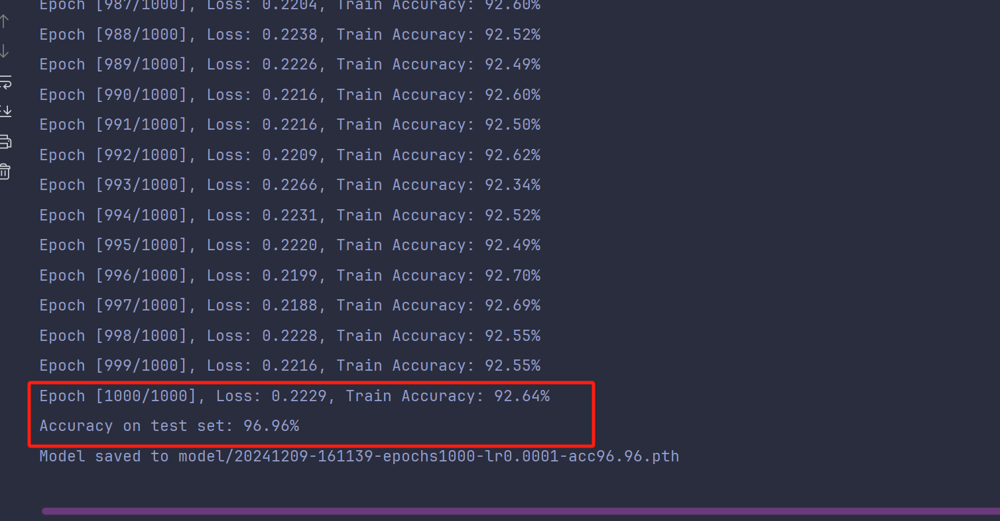

# LiGC

## 项目简介

本项目用于特定数据集（电厂故障记录）与Deepseek结合，通过RAG（检索增强生成）帮助用户检索、总结、查找并提供其他帮助的智能AI系统。所使用的技术栈包括：

- 前端：Vue3、TypeScript
- 后端：python Flask requests Pytorch transformer
- LLM：Ollama部署的Deepseek-R1蒸馏版
- Embedding：chinese-roberta-wwm-ext
- 数据库：ElasticSearch、MySQL

## 项目展示
登陆页：

注册页：

效果展示-故障记录查询：

效果展示-机器学习编码预测：

## 环境准备

```bash
# python
python3 -m venv venv
source venv/bin/activate
pip install --upgrade pip
pip install -r requirements.txt

# vue
npm install -i
```

## 相关依赖

### ES

可在 https://www.elastic.co/downloads/elasticsearch 中选择版本下载。下载后使用如下命令部署：

```bash
cd elasticsearch-8.17.3
bash bin/elasticsearch
```

使用端口：`9200`

### Ollama

可在 https://ollama.com 中下载，下载后使用桌面端app打开或执行：

```bash
ollama serve
```

使用端口：`11434`

启动后根据需要下载模型，如：
```bash
ollama run deepseek-r1:32b
```

> 注: 本项目运行环境内存大小为32G，受到内存限制，目前至多只能支持deepseek-r1的32B蒸馏版。
### Embedding Model

本项目所使用的编码模型为 `chinese-roberta-wwm-ext` ，可在 https://huggingface.co/hfl/chinese-roberta-wwm-ext
获取相关资源，也可以使用其他类似编码模型（要求`dim=768`)

下载后推荐置于 `~/LiGC/py/` 下，命名为 `chinese-roberta-wwm-ext`

使用如下方式调用：
```python
from transformers import AutoTokenizer, AutoModelForMaskedLM
import torch

tokenizer = AutoTokenizer.from_pretrained("py/chinese-roberta-wwm-ext")
model_bert = AutoModelForMaskedLM.from_pretrained("py/chinese-roberta-wwm-ext", output_hidden_states=True)

def get_embedding(text, tokenizer, model_bert):
    inputs = tokenizer(text, return_tensors="pt", padding=True, truncation=True, max_length=256)

    with torch.no_grad(), torch.amp.autocast(device_type='cuda', dtype=torch.float16):
        outputs = model_bert(**inputs)
        last_hidden_state = outputs.hidden_states[-1]

        # 只取 CLS token 的嵌入
        cls_embedding = last_hidden_state[:, 0, :].cpu().numpy()
        cls_embedding = cls_embedding.reshape(1, 1, cls_embedding.shape[1])  # Reshape

    return cls_embedding.tolist()[0][0]
```
## 数据准备

首先存储原始csv数据，在 `py/scr` 下新建文件 `config.py` 设置es基本信息和数据、模型路径等信息：
```python config.py
USER = "elastic"
PASSWORD = "xxx"

data_path = 'py/data/DATA.csv'
data_path_json = 'py/data/DATA.json'
bert_model_path = 'py/chinese-roberta-wwm-ext'
ds_url = "http://localhost:11434/api/chat"
```
然后执行：
```bash
python py/src/data_init.py
```

此脚本会在 `data_path_json` 生成带有向量字段的json数据。完成后执行：

```bash
python py/src/data_insert.py
```

```text
成功连接到Elasticsearch！
索引 cr_index 已删除。
索引 cr_index 已创建。

成功插入 109200 条数据，失败 0 条数据
所有文档插入成功！
```

至此向量数据库建立成功

## 启动API

执行：
```bash
python py/main.py
```

```bash
(.venv) soldierbai@xxx LiGC % python py/main.py
Some weights of the model checkpoint at py/chinese-roberta-wwm-ext were not used when initializing BertForMaskedLM: ['bert.pooler.dense.bias', 'bert.pooler.dense.weight', 'cls.seq_relationship.bias', 'cls.seq_relationship.weight']
- This IS expected if you are initializing BertForMaskedLM from the checkpoint of a model trained on another task or with another architecture (e.g. initializing a BertForSequenceClassification model from a BertForPreTraining model).
- This IS NOT expected if you are initializing BertForMaskedLM from the checkpoint of a model that you expect to be exactly identical (initializing a BertForSequenceClassification model from a BertForSequenceClassification model).
 * Serving Flask app 'main'
 * Debug mode: off
WARNING: This is a development server. Do not use it in a production deployment. Use a production WSGI server instead.
 * Running on all addresses (0.0.0.0)
 * Running on http://127.0.0.1:5010
 * Running on http://xxx.xxx.xxx.xxx:5010
Press CTRL+C to quit
```
此脚本会在本地使用5010端口启动一个流式输出的api

检查api可用性：
```python
import json
import requests

url = 'http://127.0.0.1:5010/api/chat/completions'

payload = {
    'inputs': '帮我找下消防隐患的相关记录',

}

with requests.post(url, json=payload, stream=True, verify=False) as response:
    if response.status_code == 200:
        for chunk in response.iter_lines():
            if chunk:
                chunk = chunk.decode("utf-8")
                try:
                    chunk = chunk.strip('\n\n').strip('\n').strip('data:').strip(' ')
                    chunk_json = json.loads(chunk)
                    # message = chunk_json.get("message", {})
                    # content = message.get("content", "")
                    # if content:
                    #     print(content, end="", flush=True)
                    print(chunk_json)
                except json.JSONDecodeError:
                    print("Error decoding JSON chunk:", chunk)
    else:
        print(response.text)
```

## 启动主程序
根目录下执行：
```bash
npm run dev
```

```bash
soldierbai@xxx LiGC % npm  run dev                  

> ds-rag@0.0.0 dev
> vite


  VITE v6.1.0  ready in 439 ms

  ➜  Local:   http://localhost:5173/
  ➜  Network: use --host to expose
  ➜  Vue DevTools: Open http://localhost:5173/__devtools__/ as a separate window
  ➜  Vue DevTools: Press Option(⌥)+Shift(⇧)+D in App to toggle the Vue DevTools
  ➜  press h + enter to show help
```

即可在 `http://localhost:5173/` 中体验本项目全部功能。


## 分类模型
### 分类模型训练
```bash
python py/src/main.py
```
训练效果：

准确率：

